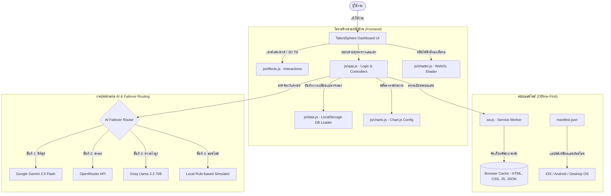

# 🚀 TalentSphere AI Ecosystem

**ระบบบริหารงานและพัฒนาบุคลากรขับเคลื่อนด้วย AI อัจฉริยะ (Client-Side PWA)**  
*ผลงานส่งเข้าประกวด Hackathon Challenge: The "Living" App (48 Hours)*

แอปพลิเคชันรูปแบบ Client-side Web Application เต็มรูปแบบที่ชุบชีวิตข้อมูลดิบ JSON ของบุคลากร คอร์สเรียน การทำงาน และการลงทะเบียนพัฒนาทักษะ ให้กลายเป็นระบบนิเวศการบริหารงานอัจฉริยะที่สามารถทำงานร่วมกันได้อย่างลงตัว ภายใต้ธีมการออกแบบกระจกฝ้า **Liquid Glass Theme** และพื้นหลังไฟฟ้าคลื่นทองระยิบระยับ

---

<p align="center">
  
  
  
  
  
  
</p>

---

## 📌 สารบัญ (Table of Contents)
1. [🎯 แนวคิดและนวัตกรรมผลิตภัณฑ์ (Product Thinking)](#🎯-แนวคิดและนวัตกรรมผลิตภัณฑ์-product-thinking--innovation)
2. [🧠 บทบาทของ AI และการยกระดับระบบ (AI Impact & Comparison)](#🧠-บทบาทของ-ai-และการยกระดับระบบ-ai-impact--comparison)
3. [🏗️ สถาปัตยกรรมระบบ (Architecture & Flow)](#%EF%B8%8F-สถาปัตยกรรมระบบ-architecture--flow)
4. [✨ คุณสมบัติและฟีเจอร์หลัก (Core Features & MVP)](#✨-คุณสมบัติและฟีเจอร์หลัก-core-features--mvp)
5. [🎁 ฟีเจอร์เพิ่มเติม & Wow-Effects](#🎁-ฟีเจอร์เพิ่มเติม--wow-effects)
6. [🛠️ เทคโนโลยีที่ใช้ (Tech Stack)](#🛠️-เทคโนโลยีที่ใช้-tech-stack)
7. [📂 โครงสร้างโฟลเดอร์ของโครงการ](#📂-โครงสร้างโฟลเดอร์ของโครงการ)
8. [🚀 คู่มือการติดตั้งและเปิดใช้งาน (Setup Guide)](#🚀-คู่มือการติดตั้งและเปิดใช้งาน-setup--usage)

---

## 🎯 แนวคิดและนวัตกรรมผลิตภัณฑ์ (Product Thinking & Innovation)
ระบบนี้แก้ปัญหาระหว่าง **"การส่งมอบงานให้เสร็จตามกำหนด (Task Delivery)"** และ **"การพัฒนาทักษะพนักงาน (Upskilling)"** ที่มักจะแยกออกจากกันในองค์กร โดยการดึง AI มาทำหน้าที่เป็น **AI Agent** และตัวช่วยวิเคราะห์ช่องว่างทักษะ (Skill Gaps) รวมทั้งความเสี่ยงโครงการแบบอัตโนมัติ:
*   **3-Month Skill Gap Analyzer**: คาดการณ์ช่องว่างทักษะล่วงหน้า 3 เดือน โดยการประมวลผลดึงข้อมูล Roadmap โปรเจกต์ในอนาคต (เช่น Mobile App Launch) มาสแกนหาข้อกำหนดทักษะที่ต้องการ เปรียบเทียบกับทักษะปัจจุบันของบุคลากร 15 คนในทีม เพื่อระบุจุดบกพร่องของทีมล่วงหน้า พร้อมแนะนำหลักสูตร LMS ที่เหมาะสมอุดรอยรั่วทักษะทันที
*   **AI Agent**: คิดแผนเสนอโครงการย่อย (Sub-projects) 3 รายการเพื่อความสมดุลด้านกำลังคนและช่วยลดความเสี่ยงโครงการล่วงหน้า พร้อมปุ่มอนุมัติเพื่อบันทึกลงระบบและตารางงานทันที
*   **AI Failover Router**: ป้องกันปัญหาระบบล่มด้วยสถาปัตยกรรมการจัดเส้นทาง AI ถึง 4 ชั้น (Gemini -> OpenRouter -> Groq -> Local Simulator) การันตีแอปใช้งานได้ 100% เสมอ

---

## 🧠 บทบาทของ AI และการยกระดับระบบ (AI Impact & Comparison)
ระบบนิเวศแห่งนี้ขับเคลื่อนโดย AI อย่างแท้จริง โดยเข้ามาปฏิรูปกระบวนการบริหารจัดการแบบดั้งเดิม (ที่ไม่มี AI) ให้มีประสิทธิภาพและรวดเร็วกว่าอย่างก้าวกระโดด:

| ขอบเขตการทำงาน | ❌ เมื่อไม่มีระบบ AI (Traditional Workflow) |  เมื่อมีระบบ AI-TALENT (AI-Driven) |
| :--- | :--- | :--- |
| **การวิเคราะห์ทักษะที่ขาดแคลน<br>(Skill Gap Analysis)** | ผู้จัดการฝ่ายบุคคล (HR) หรือหัวหน้าทีมต้องมานั่งไล่ดูข้อมูลรายงานคอร์สเรียน LMS ของพนักงานแต่ละคน เทียบกับเดดไลน์โปรเจกต์เองทีละงาน มีความล่าช้าและเสี่ยงต่อการหลุดรอดสูง (Human Error) | **3-Month Skill Gap Analyzer** ทำการสแกนความเชื่อมโยงของ Roadmap โปรเจกต์ในอนาคตเทียบกับประวัติทักษะและคอร์สเรียนปัจจุบันของพนักงานทุกคน คาดการณ์จุดติดขัดล่วงหน้า 3 เดือน และแนะนำคอร์สพัฒนาทักษะรายบุคคลให้อัตโนมัติทันที |
| **การวางแผนและจ่ายงานย่อย<br>(Resource & Task Allocation)** | การคิดไอเดียเสนอโปรเจกต์ย่อยและการสรรหาพนักงานมารับผิดชอบ ใช้การระดมสมองและเดาทักษะพนักงานเป็นหลัก ส่งผลให้พนักงานได้รับงานไม่เหมาะสมกับทักษะหรือมีงานล้นมือ (Task Overload) | **AI Agent** ช่วยร่างไอเดียโปรเจกต์ย่อย 3 รูปแบบ พร้อมสแกนรายชื่อและทักษะของพนักงาน 15 คน เพื่อค้นหาผู้รับผิดชอบที่ทักษะตรงที่สุดและมีงานไม่ล้นมือ และบันทึกเข้าระบบจริงได้ด้วยการกดอนุมัติเพียงปุ่มเดียว |
| **การสนับสนุนการตัดสินใจ<br>(Decision Support & Chatbot)** | ผู้บริหารหรือพนักงานต้องดึงรายงาน CSV/Excel มาสรุปเป็นกราฟและอ่านทำความเข้าใจเองเพื่อวิเคราะห์สถานะงานที่เสร็จสิ้นหรือความล่าช้าในสถิติการเรียน | **AI Chatbot Drawer** ที่ทำงานบนคลาวด์ความไวสูง สามารถตอบโต้ประมวลผลดึงค่า `tasksData` ที่เสร็จสิ้น (Completed) มาวิเคราะห์คอขวด วิเคราะห์ทักษะขาดแคลน และสรุปรายงานสำหรับผู้บริหารได้ใน 0.5 วินาที |
| **ความต่อเนื่องและความเสถียร<br>(Ecosystem Reliability)** | หากผู้ให้บริการ API ของค่าย AI ใดค่ายหนึ่งเกิดล่มหรือเน็ตเวิร์กขัดข้อง ฟังก์ชันการประมวลผลบนแดชบอร์ดจะทำงานไม่ได้ทันทีและขึ้นข้อผิดพลาด | **AI Failover Router (สถาปัตยกรรมจัดเส้นทาง 4 ชั้น)** จะสลับสับเปลี่ยนคู่สายโมเดล AI โดยอัตโนมัติ (Gemini -> OpenRouter -> Groq -> Local Simulator) เพื่อการันตีการใช้งานได้ 100% เสมอไม่ว่าสถานการณ์ใด |

---

## 🏗️ สถาปัตยกรรมระบบ (Architecture & Flow)
การเชื่อมโยงระบบการทำงานแบบออฟไลน์และโครงสร้างการบริหารจัดการด้วย AI ออกแบบในลักษณะปิดบนเครื่องของผู้ใช้ (Client-Side) ทั้งหมด:



---

## ✨ คุณสมบัติและฟีเจอร์หลัก (Core Features & MVP)

### 1. หน้าสรุปข้อมูลภาพรวม (Dashboard / Overview)
*   **KPIs Metrics**: แสดงตัวเลขนับจำนวนงานสำเร็จ, อัตราความเสี่ยงโครงการเฉลี่ย, และสถิติทักษะที่พัฒนาสำเร็จ ด้วยแอนิเมชันวิ่งนับเลขอัตโนมัติ (Count-Up Animation)
*   **Interactive Charts**: แผนภูมิแสดงสถานะการทำงาน (Doughnut Chart) และสถิติการเรียนรู้คอร์สต่างๆ (Bar Chart) เชื่อมโยงข้อมูลแบบเรียลไทม์จากตัวฐานข้อมูล

### 2. ระบบนำทางและแจ้งเตือนด่วน (Topbar Interactive Dropdowns) (ใหม่!)
*   **Notification Panel**: แผงแจ้งเตือนการเปลี่ยนสถานะของโครงการ ความไม่สอดคล้องของทักษะกับงาน (Skill Gaps) และการเรียนสำเร็จของพนักงาน
*   **Message Panel**: แผงกล่องจดหมายเข้าล่าสุด แสดงข้อความอัปเดตงานจากนักพัฒนา (Developer) และผู้จัดการฝ่ายทรัพยากรบุคคล (HR Manager)
*   *คุณสมบัติ:* ออกแบบในสไตล์กระจกฝ้าปรับแสงกึ่งใสตามธีมมืด/สว่างโดยอัตโนมัติ และปิดตัวเองอัตโนมัติเมื่อกดคลิกนอกพื้นที่

### 3. ตารางค้นหาและคัดกรองข้อมูล (List & Search & Filter)
*   **ตารางงานแบบละเอียด**: แสดงชื่องาน, ผู้รับผิดชอบ, ฝ่าย, ระดับความสำคัญ, สถานะการทำงาน และแถบความคืบหน้า (Progress Bar)
*   **ระบบการกรองหลายมิติ**: ค้นหางานด้วยพิมพ์ชื่องานหรือชื่อพนักงาน และตัวกรองคัดแยกตามสถานะของงานและฝ่ายทำงาน

### 4. หน้ารายละเอียดเชิงลึก (Detail Page Modal)
*   เมื่อคลิกเลือกงานหรือหลักสูตร ระบบจะเปิดหน้าต่างป๊อปอัปกระจกฝ้าแสดงรายละเอียดเชิงลึกของข้อมูล แนะนำพนักงานที่มีทักษะใกล้เคียง พร้อมประวัติของงานอย่างชัดเจน

---

## 🎁 ฟีเจอร์เพิ่มเติม & Wow-Effects

### 🤖 AI Integration & Low-latency Chatbot
*   **AI Chatbot Drawer**: แชทบอร์ดผู้ช่วยส่วนตัวอัจฉริยะ โต้ตอบการวิเคราะห์ภาพรวมโครงการและแนะนำทักษะได้ภายใน 0.5 วินาที ผ่านการประมวลผลของค่าย Groq/Llama
*   **AI Insights Panel**: เจนเนอเรตรายงานความเสี่ยงโครงการเชิงลึกพร้อมข้อเสนอแนะเยียวยาคอขวดจากโมเดลระดับท็อปอย่าง Gemini-2.5-Flash

### ⚡ Real-time Data Streaming Simulation
*   **Live Simulator**: ระบบจำลองการไหลเข้าของข้อมูลโดยอัตโนมัติ (จำลองเดดไลน์กระชั้นชิด, ความก้าวหน้าของพนักงาน, งานใหม่เด้งขึ้น) สะท้อนเข้าตารางและกราฟแบบเรียลไทม์โดยไม่ต้องรีเฟรชหน้าเว็บ (สามารถเปิด/ปิดการจำลองได้ที่ด้านล่างสุดของ Sidebar)
*   **Live Ticker**: แถบอัปเดตกิจกรรมล่าสุดของระบบจำลอง (Activity Ticker) ค่อยๆ เลื่อนวิ่งด้านล่างตารางสรุป และหยุดนิ่งเมื่อเมาส์ชี้เพื่อให้อ่านได้สะดวก

### 📱 PWA & Offline-First (ใหม่!)
*   **Installable**: แอปพลิเคชันผ่านเกณฑ์ PWA มาตรฐาน รองรับการติดตั้งแบบ Standalone ลงบนโทรศัพท์มือถือและเดสก์ท็อปผ่านไฟล์ [manifest.json](manifest.json)
*   **Custom PWA Install Button**: ปุ่มติดตั้งแอปจำลอง PWA สีทองส่งคลื่นกะพริบเรืองแสง (`.pulse-glow`) บนแถบเมนูนำทาง ซึ่งจะปรากฏขึ้นมาเฉพาะเมื่อเบราว์เซอร์ตรวจสอบพบความเข้ากันได้
*   **Wow-Effects Celebrations**: เมื่อกดติดตั้งแอปพลิเคชันเสร็จสิ้น หน้าจอจะโปรยกระดาษสีเฉลิมฉลอง (Confetti) พร้อมเปิดเสียงความยินดี (Chime Sound) และขึ้นกล่องแจ้งเตือนความสำเร็จทันที เพื่อความพึงพอใจสูงสุดของผู้ใช้
*   **Offline Cached**: ทำงานร่วมกับ Service Worker [sw.js](sw.js) ในการแคชไฟล์ทั้งหมดของโครงการ (HTML, CSS, JS, SVG, JSON) ทำให้เข้าถึงข้อมูลและใช้งานได้ทันทีแม้จะขาดการเชื่อมต่ออินเทอร์เน็ต

### 🎨 Premium UI/UX: Liquid Glass & Sparkle Trail
*   **Liquid Glass Theme**: หน้าต่างกระจกฝ้าซ้อนทับกันอย่างโปร่งแสงงดงาม มีโหมดสว่างกระจกใสขาวพรีเมียมคู่ขนานไปกับโหมดมืดฝ้าเข้ม ล็อกสไตล์ให้สวยสอดคล้องลอยเด่นเหนือ WebGL Shader ด้านหลัง
*   **3D Tilt Cards (อัปเกรด)**: การ์ด KPI เอียงตามตำแหน่งเม้าส์ 15 องศา พร้อมสะท้อนแสง Glare ทำงานแบบ Instant-tracking (ไม่มีการหน่วง) และดีดตัวกลับอย่างนุ่มนวลเมื่อเมาส์เลื่อนออก
*   **WebGL Background**: ฉากหลังรันด้วย WebGL Shader ลายเส้นกราฟิกและคลื่นสั่นไหวสีทองอร่ามที่เรียบหรู
*   **Sparkle Trail**: ละอองอนุภาคสีทองระยิบระยับปลิวตามทิศทางทราฟิกการลากเม้าส์ของผู้ใช้
*   **Contrast & UI Overflow Fixes**: แก้ไขข้อบกพร่องด้านสีกรอบ Dropdown กลืนกับพื้นหลังใน Chrome และแก้บั๊กไอคอนหลุดขอบรอบ SVG rings KPI คืนความสมบูรณ์แบบให้ดีไซน์ระดับ Pixel-perfect

---

## 🛠️ เทคโนโลยีที่ใช้ (Tech Stack)
1.  **โครงสร้างหลัก**: HTML5 (Semantic & Accessible Elements), Vanilla CSS3 (Liquid Glassmorphism)
2.  **ภาษาควบคุม**: JavaScript (ES6+, Async/Await, Canvas Rendering, WebGL API)
3.  **ห้องสมุดแสดงผล**: Chart.js (การสร้างแผนภูมิ), FontAwesome 6.5 (ไอคอน)
4.  **ระบบเก็บข้อมูล**: Browser LocalStorage (ข้อมูลจำลองการบันทึกเพิ่ม/ลบงาน)

---

## 📂 โครงสร้างโฟลเดอร์ของโครงการ
```text
ai_driven_ecosystem/
│
├── index.html                    # ลิงก์หลักสำหรับเปลี่ยนเส้นทาง (Redirect) เข้าสู่ Dashboard
├── ai-talent-dashboard.html      # หน้าจออินเตอร์เฟสหลักของแอปพลิเคชัน (Dashboard PWA)
├── manifest.json                 # ไฟล์คอนฟิกการตั้งค่าตัวแปร PWA
├── sw.js                         # ไฟล์จัดการ Service Worker แคชไฟล์ออฟไลน์
├── users.json                    # ฐานข้อมูลผู้ใช้หลักต้นฉบับ
│
├── css/
│   └── style.css                 # สไตล์ชีทจัดแต่งหน้าตาของระบบธีมกระจกฝ้า Liquid Glass
│
├── js/
│   ├── data.js                   # ระบบจัดการจำลองฐานข้อมูลสด LocalStorage และตัวโหลด Env
│   ├── charts.js                 # สคริปต์วาดแผนภูมิสถิติต่างๆ ด้วย Chart.js
│   ├── shader.js                 # ระบบ WebGL Shader วาดเส้นคลื่นแสงสีทองเคลื่อนไหว
│   ├── effects.js                # แอนิเมชัน Tilt 3D, นับเลขความไวสูง, ละอองดาวเม้าส์ และ Ticker
│   └── app.js                    # สคริปต์ควบคุม Logic และตัวประสานงานหลักทั้งหมด
│
├── data/                         # ข้อมูลดิบต้นฉบับที่นำมาประมวลผล
│   ├── courses.json
│   ├── enrollments.json
│   ├── projects.json
│   └── tasks.json
│
└── icons/
    └── icon.svg                  # โลโก้เวกเตอร์สไตล์สมองทองเรืองแสงสำหรับเป็นไอคอนแอป PWA
```

---

## 🚀 คู่มือการติดตั้งและเปิดใช้งาน (Setup & Usage)

### 1. ตั้งค่า API Key ลับ (กรณีต้องการใช้งานฟีเจอร์ AI จริง)
สร้างไฟล์ชื่อ `.env` ไว้ที่ Root Directory ของโครงการ (หรือตั้งค่าในคีย์ลับของระบบ) และระบุ API Key ของค่ายที่ต้องการดังนี้:
```env
GEMINI_API_KEY=your_gemini_api_key_here
GROQ_API_KEY=your_groq_api_key_here
OPENROUTER_API_KEY=your_openrouter_api_key_here
```
*หมายเหตุ: หากไม่ใส่คีย์ลับ ระบบ AI จะเปลี่ยนเส้นทางไปเรียกโปรแกรมประมวลผลและตอบแชทบอร์ดภายในเครื่องจำลองอัตโนมัติ (Local Rule-based Simulator) ซึ่งช่วยให้ใช้งานฟีเจอร์ได้ทุกจุดโดยไม่มีปัญหาแอปแครช*

### 2. วิธีการเปิดแอปพลิเคชัน
เนื่องจากเว็บแอปพลิเคชันใช้ฟังก์ชันการดึงข้อมูลแคช (Fetch) และ Service Worker บราวเซอร์จำเป็นต้องรันหน้าเว็บผ่าน Local Web Server (ไม่สามารถเปิดไฟล์ด้วยการดับเบิลคลิกไฟล์ HTML ตรงๆ ได้)
*   **ทางเลือกที่ 1 (สะดวกที่สุด)**: ดับเบิลคลิกเปิดไฟล์ `run.bat` ที่เตรียมไว้ในเครื่อง ระบบจะเปิดเซิร์ฟเวอร์จำลองและนำเข้าหน้าเว็บให้อัตโนมัติ
*   **ทางเลือกที่ 2 (Node.js)**: เปิด PowerShell หรือ Terminal ในโฟลเดอร์โครงการแล้วพิมพ์คำสั่ง:
    ```bash
    npx serve
    ```
    จากนั้นเปิดเว็บเบราว์เซอร์ไปที่ลิงก์ที่แสดงผลขึ้นมา (เช่น `http://localhost:3000`)
